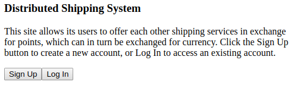
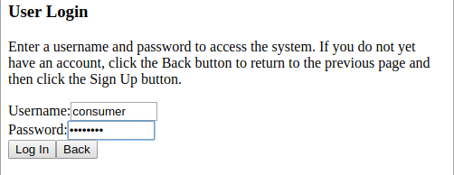
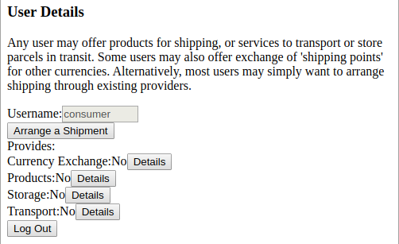
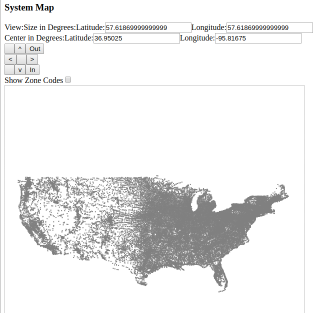

Distributed Shipping System
===========================

The code in this repository partially implements a prototype of a site that allows its users to offer each other shipping services in exchange for points, which can in turn be exchanged for currency.

To see it in action, open the file Source/DistributedShipping.html in a web browser that runs JavaScript.  If running directly from the filesystem rather than via a web server, it may also be necessary to disable some of the browser's security features.  For example, Google Chrome must be run with the --allow-file-access-from-files flag.  Any of the usernames "admin", "collector", "consumer", "exchange", "hauler", "producer", "transporter", or "warehouse" can be used to log in.  The password for all accounts is currently just "password".  (Obviously this system is not yet ready for production.)

